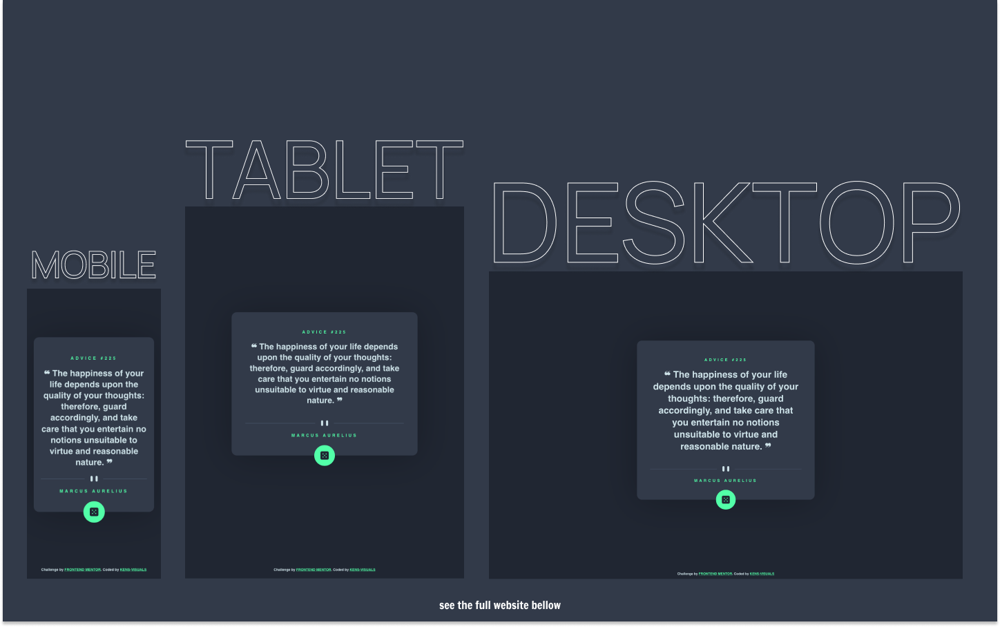

# Frontend Mentor - Advice Generator App Solution

This is a solution to the [Advice Generator App Challenge on Frontend Mentor](https://www.frontendmentor.io/challenges/advice-generator-app-QdUG-13db).

## Table of contents

- [Overview](#overview)
  - [The challenge](#the-challenge)
  - [Screenshot](#screenshot)
  - [Links](#links)
- [My process](#my-process)
  - [Built with](#built-with)
  - [What I learned](#what-i-learned)
  - [Continued development](#continued-development)
  - [Useful resources](#useful-resources)
- [Author's Links](#authors-links)

## Overview

### The challenge

Users should be able to:

- View the optimal layout depending on their device's screen size
- See hover states for interactive elements
- Generate random avice from API

### Screenshot

### Links

- Live Site URL: [https://kens-visuals.github.io/advice-generator-app/](https://kens-visuals.github.io/advice-generator-app/)
- Solution URL: [TO_BE_UPDATED](TO_BE_UPDATED)

## My process

### Built with

- React
- Styled Components
- [stoic-quotes API](https://github.com/benhoneywill/stoic-quotes)
- Semantic HTML5 markup
- CSS Flexbox
- CSS Grid
- Mobile-first workflow

### What I learned

This wasn't the first time of me working with API, but a similar project was on my list for a while. Now, thanks to Frontend Mentor's good looking design, I've got a random Stoic advice generator that I'm using on daily basis. Although the initial API was different, I wanted to build something that me and my friends will use on daily basis. And when I add the website to my phone's homescreen it feels like a legit app. I'm pretty pumped on this, and as would Epictetus say, "He is a wise man who does not grieve for the things which he has not, but rejoices for those which he has.".

### Continued development

I'm planning on adding animation to this project, I'm currently learning Framer Motion. Perhaps, my up and coming projects will already include animations.

### Useful resources

- [stoic-quotes API](https://github.com/benhoneywill/stoic-quotes) - The API that's providing all these wonderful quotes.
- [CSS Box Shadows](https://getcssscan.com/css-box-shadow-examples) - My go to list for box shadows.

## Author's Links

- Medium - [@kens_visuals](https://medium.com/@kens_visuals)
- CodePen - [@kens-visuals](https://codepen.io/kens-visuals)
- Codewars - [@kens_visuals](https://www.codewars.com/users/kens_visuals)
- Frontend Mentor - [@kens-visuals](https://www.frontendmentor.io/profile/kens-visuals)
